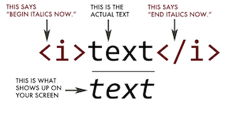

```{r setup, include=FALSE}
knitr::opts_chunk$set(
  comment = "#>",
  collapse = T,
  cache = F,
  out.width = "70%",
  fig.align = 'center',
  fig.width = 6,
  fig.asp = 0.618,  # 1 / phi
  fig.show = "hold"
)
```

```{r include=FALSE} 
# include any code here you don't want to show up in the document,
# e.g. package and dataset loading
library(tidyverse)
#library(kableExtra)
library(rtweet)
```

### Collecting Data from the Web

There's a ton of web data that's useful to social scientists, including:

* social media
* news media
* government publications
* organizational records

There are two ways to get data off the web:

1. **Web APIs** - i.e. application-facing, for computers
2. **Webscraping** - i.e. user-facing websites for humans

__Rule of Thumb__: Check for API first. If not available, scrape.

---
## Webscraping v. APIs

* Webscraping Benefits
    * Any content that can be viewed on a webpage can be scraped. [Period](https://blog.hartleybrody.com/web-scraping/)
    * No API needed
    * No rate-limiting or authentication (usually)

* Webscraping Challenges
    * Rarely tailored for researchers
    * Messy, unstructured, inconsistent
    * Entirely site-dependent

* Rule of thumb:
    - Check for API first. If not available, scrape.

---
## Some Disclaimers

* Check a site's terms and conditions before scraping.

* Be nice - don't hammer the site's server. Review [these ethical webscraping tips](https://towardsdatascience.com/ethics-in-web-scraping-b96b18136f01)

* Sites change their layout all the time. Your scraper will break.

---
## What's a website

* Some combination of **code**base + **data**base that lives on a server.

* When it gets to us (the "front end"), it's delivered to us as HTML + CSS stylesheets + javascript.

```{html}
"<!DOCTYPE html>\n<html lang=\"mul\" dir=\"ltr\">\n<head>\n<!-- Sysops: 
Please do not edit the main template directly; update /temp and synchronise. 
-->\n<meta charset=\"utf-8\">\n<title>Wikipedia</title>\n<!--[if lt IE 7]><meta
http-equiv=\"imagetoolbar\" content=\"no\"><![endif]-->\n<meta name=\"viewport\"
content=\"i"
```

---
## What's a website

* Your browser turns that into a nice layout.


---
## Websites return HTML

* HTML stands for **H**yper **T**ext **M**arkup **L**anguage.

* HTML describes the **structure** of a Web page.

* HTML consists of a series of **elements**.

* HTML elements tell the browser how to display the content.

* HTML elements label pieces of content such as "this is a heading",
"this is a paragraph", "this is a link", etc.

**Pop quiz**: What markup language am I writing in right now?

---
## Webscraping returns HTML

* It's easy to pull HTML from a website.

* It's much more difficult to find the information you want from that HTML.

> Check out the source for [www.google.com](view-source:https://www.google.com/)

* So we have to learn how to **parse** HTML to find the data we want.

---
## HTML: Basic structure

```html
<!DOCTYPE html>
<html>
	 <head>
		<title>Page title</title>
	</head>
 	<body>
 		<p>Hello world!</p>
 	</body>
</html>
```
---
## HTML is a Tree

* Each branch of the tree is called an *element*.

* HTML elements can contain other elements.


---
## HTML Elements

An HTML element is defined by a start tag, some content, and an end tag:



The HTML element is everything from the start tag to the end tag.

---
## Common HTML tags

| Tag        | Meaning           | 
| ------------- |-------------  |
| `<head>`     | page header (metadata, etc) | 
| `<body>`     | holds all of the content |
| `<p>` | regular text (paragraph) |
| `<h1>`, `<h2>`, `<h3>` | header text, levels 1, 2, 3  |
| `ol,`, `<ul>`, `<li>` | ordered list, unordered list, list item |
| `<a href="page.html">` | link to "page.html" |
| `<table>`, `<tr>`, `<td>`  | table, table row, table item |
| `<div>`,`<span>` | general containers |

---
## HTML Page Structure


---
## HTML Attributes

.pull-left[
* HTML elements can have attributes, which provide additional information about an element.

* Attributes are always specified in the start tag.

* Attributes come in name/value pairs like: name="value"
]

.pull-right[

]

---
## Finding HTML 

Sometimes we can find the data we want just by using HTML tags or attributes (e.g, all the `<a>` tags)

More often, this isn't enough: There might be 1000 `<a>` tags on a page. But maybe we want only the `<a>` tags *inside* of a `<p>` tag.

Enter CSS...

---
## CSS (**Cascading** Style Sheet) 

CSS defines how HTML elements are displayed.


--
HTML came first. But it was only meant to *define* content, not *format *it. 


--
While HTML contains tags like `<font>` and `<color>`, this is a very inefficient way to develop a website. Some websites can easily contain 100+ individual pages, which with their own html code.


--
To solve this problem, CSS was created specifically to display content on a webpage. Now, one can change the look of an entire website just by changing one file. "Make all the links red."


--
Most web designers litter their HTML markup with tons of `classe`s and `id`s to provide "hooks" for their CSS.


--
You can piggyback on these "hooks" to jump to the parts of the markup that contain the data you need.

---
## CSS Anatomy: Selectors

| Type  | HTML    | CSS Selector   | 
| :----- | :-------: | -------------:  |
| Element | `<a>`,     | `a` <br> `p a`| 
| Class | `<a class="blue">`  | `.blue` <br> `a.blue` |
| ID | `<a id="blue">` | `#blue` <br> `a#blue` |


---
## CSS Anatomy: Hooks


---

```html
<body>
	<table class="content">
    	<tr id='kurtis'>
        	<td class='firstname'>
         		Kurtis
        	</td>
        	<td class='lastname'>
          		McCoy
        	</td>
    	</tr>
    	<tr id='leah'>
      		<td class='firstname'>
          		Leah
        	</td>
        	<td class='lastname'>
          		Guerrero
     		</td>
    	</tr>
 	</table>
</body>
```

---
### Challenge 1

Find the CSS selectors for the following elements in the HTML above.

(Hint: There will be multiple solutions for each)

1. The entire table

2. The row containing "Kurtis McCoy"

3. Just the element containing first names

---
### Challenge 1 Solutions

Find the CSS selectors for the following elements in the HTML above.

(Hint: There will be multiple solutions for each)

1. The entire table
  * `table`, `.content`

2. The row containing "Kurtis McCoy"
  * `#kurtis`

3. Just the element containing first names
  * `.firstname`


---
### Finding Elements with Selector Gadget

* Selector Gadget is a browser plugin to help you find HTML elements. 

* Install Selector Gadget on your browser by following instructions here: https://selectorgadget.com/

* Run Selector Gadget and click on the type of information you want to select. 

* Then click the pieces of information you **don't** want to keep. 

* Do this until only the pieces you want to keep remain highlighted.

* Copy the selector from the bottom pane.

---
### Putting it all together:

Here's the basic strategy of webscraping:

1. Use Selector Gadget to see how your data is structured.

2. Pay attention to HTML tags and CSS selectors.

3. Pray that there is some kind of pattern.

4. Use R and add-on modules like `RVest` to extract just that data.


---
### Challenge 2

Go to http://rochelleterman.github.io/. Using Selector Gadget,

1. Find the CSS selector capturing all rows in the table.

2. Find the image source URL.

3. Find the HREF attribute of the link.

---
### Challenge 2 Solutions

Go to http://rochelleterman.github.io/. Using Selector Gadget,

1. Find the CSS selector capturing all rows in the table.
  * `td`
  
2. Find the image source URL.
  * `https://media.giphy.com/media/8V3RG6l2dp1wQ/giphy.gif`
  
3. Find the HREF attribute of the link.
  * `https://www.youtube.com/watch?v=NCtzkaL2t_Y`


